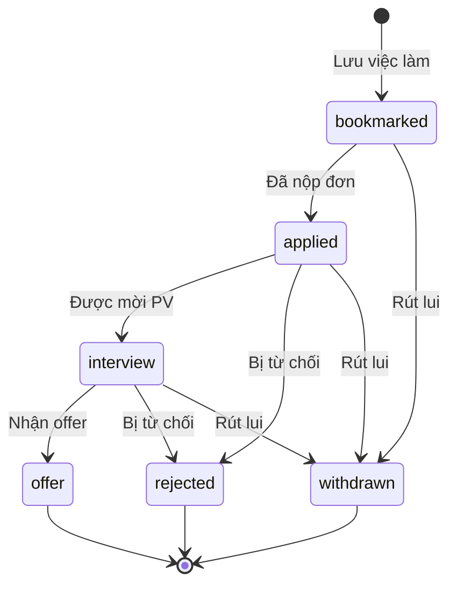
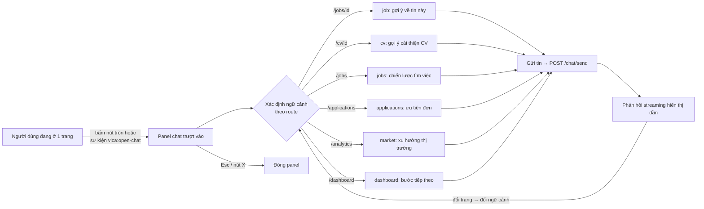

# Vica — Wireframe & UI Flow

**Sơ đồ luồng màn hình và bố cục giao diện**

| | |
|---|---|
| **Sản phẩm** | Vica |
| **Loại tài liệu** | Wireframe / UI Flow |
| **Phiên bản** | 1.0 |
| **Ngày** | 13/06/2026 |

> Ghi chú: Các wireframe dưới đây là dạng **low-fidelity** (khung xương) bằng ký tự ASCII, mô tả bố cục và phân cấp thông tin, không thể hiện màu sắc/typography cuối cùng. Hệ màu thực tế: nền sáng, điểm nhấn đen mực `slate-900` + một màu nhấn xanh; landing page dùng hero nền tối.

---

## 1. Sơ đồ điều hướng tổng thể (Site Map)

```
Vica
│
├── PUBLIC (chưa đăng nhập)
│   ├── /                     Landing page
│   ├── /auth/register        Đăng ký
│   └── /auth/login           Đăng nhập
│
└── APP (đã đăng nhập — có Sidebar + Chat Dock toàn cục)
    ├── /onboarding           Upload & bóc tách CV (bắt buộc lần đầu)
    ├── /dashboard            Tổng quan
    ├── /jobs                 Tìm việc
    │   └── /jobs/[id]        Chi tiết việc làm + Đánh giá AI
    ├── /applications         Theo dõi ứng tuyển (Kanban / Bảng)
    ├── /cv                   Danh sách CV
    │   └── /cv/[id]          Trình chỉnh sửa CV + Gợi ý AI
    ├── /analytics            Phân tích thị trường
    └── /profile             Hồ sơ cá nhân
```

---

## 2. Luồng người dùng chính (Primary User Flow)

```mermaid
flowchart TD
    A([Khách truy cập]) --> B[Landing page /]
    B -->|Bắt đầu miễn phí| C[Đăng ký /auth/register]
    B -->|Đã có tài khoản| D[Đăng nhập /auth/login]
    C --> E{Đã onboard?}
    D --> E
    E -->|Chưa| F[Onboarding: Upload CV]
    E -->|Rồi| G[Dashboard]
    F -->|AI bóc tách CV| G
    F -->|Bỏ qua| G

    G --> H[Tìm việc /jobs]
    H -->|Chọn 1 tin| I[Chi tiết việc làm /jobs/id]
    I -->|Đánh giá độ phù hợp| J[[AI chấm điểm 4 tiêu chí]]
    J -->|Lưu vào tracker| K[Ứng tuyển /applications]
    I -->|Tạo CV cho vị trí| L[CV Builder /cv]
    L --> M[Chỉnh sửa CV /cv/id]
    M -->|AI gợi ý + xuất PDF| K
    K -->|Cập nhật trạng thái| K
    G --> N[Phân tích thị trường /analytics]

    %% Chat toàn cục
    I -. mở chat ngữ cảnh .-> Z[(Trợ lý AI — panel phải)]
    H -. .-> Z
    K -. .-> Z
    M -. .-> Z
    G -. .-> Z
```

**Diễn giải luồng "happy path":** Khách → Đăng ký → Onboarding (upload CV) → Dashboard → Tìm việc → Xem chi tiết → AI đánh giá độ phù hợp → Lưu/Ứng tuyển → Tạo & tối ưu CV → Theo dõi trên Kanban. Trợ lý AI luôn sẵn sàng ở panel bên phải trên mọi trang trong app.

---

## 3. Khung layout chung của App (Global Shell)

Mọi trang sau khi đăng nhập đều nằm trong khung sau: **Sidebar trái (thu gọn/mở rộng khi hover)** + **vùng nội dung** + **Chat Dock phải (panel trượt)**.

```
┌────┬───────────────────────────────────────────────┬───────────────┐
│ V  │  [Nội dung trang]                              │   (Chat Dock  │
│    │                                                │    đóng:       │
│ ▦  │                                                │    chỉ có nút  │
│ ⌕  │                                                │    tròn nổi    │
│ ▤  │                                                │    góc dưới)   │
│ ▢  │                                                │               │
│ ◔  │                                                │          ( • ) │
│    │                                                │               │
├────┤                                                │               │
│ 👤 │                                                │               │
│ AB │                                                │               │
└────┴───────────────────────────────────────────────┴───────────────┘
 72px         vùng nội dung co/giãn theo panel

Sidebar khi HOVER (mở rộng 240px):
┌──────────────────┐
│ Vica             │
│ ▦  Tổng quan     │ ← active: nền đen, chữ trắng
│ ⌕  Tìm việc      │
│ ▤  Ứng tuyển     │
│ ▢  CV Builder    │
│ ◔  Thị trường    │
│ ─────────────    │
│ 👤 Hồ sơ cá nhân │
│ ┌─────────────┐  │
│ │ AB  Tên User│⎋ │ ← avatar + tên/email + đăng xuất
│ │     email   │  │
│ └─────────────┘  │
└──────────────────┘
```

**Chat Dock khi MỞ (panel 420px trượt từ phải):**

```
                         ┌─────────────────────────────┐
                         │ ✦ Vica AI            [ X ]   │
                         │ Đang xem: Việc làm này       │
                         ├─────────────────────────────┤
                         │                             │
                         │   Hỏi về việc làm này        │
                         │   (gợi ý prompt theo ngữ cảnh)│
                         │  ┌─────────────────────────┐ │
                         │  │ Tôi có phù hợp không?    │ │
                         │  └─────────────────────────┘ │
                         │  ┌─────────────────────────┐ │
                         │  │ Chiến lược ứng tuyển     │ │
                         │  └─────────────────────────┘ │
                         │                             │
                         │   [tin nhắn user] ───▶ phải  │
                         │   ◀─── [phản hồi AI streaming]│
                         ├─────────────────────────────┤
                         │ [ Hỏi về việc làm này...  ↑] │
                         └─────────────────────────────┘
```

---

## 4. Wireframe từng màn hình

### 4.1. Landing page (`/`) — concept hero tối

```
┌──────────────────────────────────────────────────────────┐
│            ╭─────────────────────────────────╮           │  ← nav pill kính mờ (nổi giữa)
│            │ Vica   Đăng nhập  [Bắt đầu]      │           │
│            ╰─────────────────────────────────╯           │
│   ░░░ HERO NỀN TỐI — aurora glow + spotlight bám chuột ░░ │
│                                                          │
│              • AI đồng hành hành trình tìm việc          │  ← badge
│                                                          │
│              TÌM VIỆC THÔNG MINH,                        │  ← headline động
│              bắt đầu từ hôm nay.                          │  ← (gradient xanh)
│                                                          │
│         Từ tìm kiếm, đánh giá AI, tạo CV…                 │
│                                                          │
│         [ Bắt đầu miễn phí → ]  [ Đã có tài khoản ]       │
│                                                          │
│        ┌───────────────── mockup dashboard 3D ────┐      │  ← nghiêng theo chuột
│        │ ▦ Chào buổi sáng, Thái   [24][8][3][86]  │      │     + thẻ nổi (điểm AI,
│        │   ▓▓▓▓▓▓░░ 86%   ▓▓▓▓░░ 72% …            │      │       job, CV chip)
│        └──────────────────────────────────────────┘      │
│   ── VietnamWorks · TopCV · ITviec · CareerViet … ──     │  ← marquee chạy ngang
├──────────────────────────────────────────────────────────┤
│  [ 4+ ]   [ 10k+ ]   [ AI ]   [ 100% ]                    │  ← số liệu đếm tăng
├──────────────────────────────────────────────────────────┤
│  TÍNH NĂNG — bento grid                                   │
│  ┌───────────────────────┐ ┌──────────────┐              │
│  │ AI đánh giá phù hợp    │ │ 4 cổng việc  │              │
│  │ (thanh điểm mini)      │ │ làm, 1 ô tìm │              │
│  └───────────────────────┘ └──────────────┘              │
│  ┌──────────────┐ ┌──────────────┐ ┌──────────────────┐  │
│  │ Theo dõi      │ │ CV builder   │ │ AI đồng hành     │  │
│  │ (kanban mini) │ │ (CV mini)    │ │ (chat bubbles)   │  │
│  └──────────────┘ └──────────────┘ └──────────────────┘  │
├──────────────────────────────────────────────────────────┤
│  CÁCH HOẠT ĐỘNG:  01 ──── 02 ──── 03                     │
├──────────────────────────────────────────────────────────┤
│  ░░ CTA nền tối: "Sẵn sàng cho offer đầu tiên?" ░░       │
│            [ Đăng ký miễn phí → ]                         │
├──────────────────────────────────────────────────────────┤
│  Vica · 2025          VietnamWorks · TopCV · ITviec …    │
│  ░░░░░░░░  V I C A  (watermark khổng lồ)  ░░░░░░░░        │
└──────────────────────────────────────────────────────────┘
```

### 4.2. Đăng ký / Đăng nhập (`/auth/register`, `/auth/login`)

```
┌──────────────────────────────────────────┐
│                 Vica                      │
│         Tạo tài khoản miễn phí            │
│   ┌────────────────────────────────────┐ │
│   │ Email                              │ │
│   ├────────────────────────────────────┤ │
│   │ Mật khẩu                           │ │
│   └────────────────────────────────────┘ │
│   [        Đăng ký        ]               │
│   Đã có tài khoản? Đăng nhập              │
└──────────────────────────────────────────┘
```

### 4.3. Onboarding (`/onboarding`) — Upload CV

```
┌───────────────────────────────────────────────────────────┐
│ Vica            01 / 03 · UPLOAD CV              [Bỏ qua]  │
├──────────────────────────────┬────────────────────────────┤
│  Chào {tên}.                 │   ┌──────────────────────┐  │
│  CV tốt hơn, bắt đầu từ đây. │   │      ⬆ Upload         │  │
│                              │   │  Kéo-thả CV vào đây   │  │
│  01  Upload CV của bạn       │   │  hoặc bấm để chọn     │  │
│  02  AI phân tích hồ sơ      │   │  (.pdf .doc .txt)     │  │
│  03  Bắt đầu tìm việc        │   │  [ đính kèm CV…    ↑] │  │
│                              │   └──────────────────────┘  │
└──────────────────────────────┴────────────────────────────┘
        (toàn trang hỗ trợ kéo-thả → overlay "Thả CV vào đây")

→ Sau khi upload: màn hình "Đang phân tích…" (logo + thanh tiến trình)
→ AI bóc tách → chuyển sang /dashboard
```

### 4.4. Dashboard (`/dashboard`)

```
┌───────────────────────────────────────────────────────────┐
│ Chào buổi sáng, Thái                                      │
│ Tiến độ tìm việc của bạn tuần này                          │
├──────────┬──────────┬──────────┬──────────┬──────────────┤
│ 24       │ 8        │ 32%      │ 120      │ 86           │  ← 5 chỉ số
│ Đơn ƯT   │ Active   │ Tỷ lệ TC │ Đã xem   │ Fit TB       │
├───────────────────────────────┬───────────────────────────┤
│  PIPELINE (biểu đồ tròn)       │  THAO TÁC NHANH           │
│        ╭───────╮               │  → Tìm việc mới           │
│       │  ◔ ◕   │               │  → Xem ứng tuyển          │
│        ╰───────╯               │  → Tạo CV                 │
│  ▪ applied ▪ interview …       │  → Hỏi AI tư vấn (chat)   │
└───────────────────────────────┴───────────────────────────┘
```

### 4.5. Tìm việc (`/jobs`)

```
┌───────────────────────────────────────────────────────────┐
│ Tìm việc                                                  │
│ ┌─────────────────────────────┐ ┌──────────┐ [ Tìm kiếm ] │
│ │ 🔍 Từ khóa…                  │ │ Địa điểm │              │
│ └─────────────────────────────┘ └──────────┘              │
│ Nguồn: (Tất cả) (VietnamWorks) (TopCV) (ITviec) (CareerViet)│  ← chip filter
│ Tìm nhanh: Frontend · Data · Intern …                      │
├───────────────────────────────────────────────────────────┤
│ ┌─────┐ Frontend Developer — Tiki        [⊕][↗][Đánh giá AI]│
│ │ logo│ TP.HCM · 15–25tr · React · TS …   ▪VietnamWorks ▪Remote│
│ ├─────┤───────────────────────────────────────────────────│
│ │ logo│ Product Engineer — MoMo          [⊕][↗][Đánh giá AI]│
│ └─────┘ Hà Nội · Thỏa thuận · Node …      ▪TopCV            │
│         … (danh sách phẳng, divide-y) …                    │
└───────────────────────────────────────────────────────────┘
```

### 4.6. Chi tiết việc làm (`/jobs/[id]`)

```
┌───────────────────────────────────────────────────────────┐
│ ← Quay lại tìm kiếm                                        │
│ ┌─────┐ Frontend Developer                                │
│ │ logo│ Tiki · TP.HCM · 15–25tr · Remote · VietnamWorks   │
│ └─────┘ [ ✦ Đánh giá độ phù hợp ] [ Lưu vào tracker ] [↗] │
├───────────────────────────────────────────────────────────┤
│ KẾT QUẢ ĐÁNH GIÁ AI                       86/100 · Phù hợp │
│  Kỹ năng kỹ thuật   ▓▓▓▓▓▓▓▓░░  82                         │
│  Kinh nghiệm        ▓▓▓▓▓▓░░░░  65                         │
│  Văn hóa & hành vi  ▓▓▓▓▓▓▓░░░  78                         │
│  Định hướng         ▓▓▓▓▓▓▓▓▓░  88                         │
│  ┌── Điểm mạnh ──┐  ┌── Khoảng cách ──┐                   │
│  │ · React tốt   │  │ · Thiếu CI/CD    │                   │
│  └───────────────┘  └──────────────────┘                  │
│  Khuyến nghị: …                                            │
│  → Tạo CV cho vị trí này   → Hỏi AI về chiến lược (chat)   │
├──────────────────────────────┬────────────────────────────┤
│ MÔ TẢ CÔNG VIỆC              │ KỸ NĂNG CẦN CÓ             │
│ Yêu cầu …                    │ React · TS · Next.js …     │
│                              │ PHÚC LỢI …                 │
└──────────────────────────────┴────────────────────────────┘
```

### 4.7. Theo dõi ứng tuyển (`/applications`) — Kanban

```
┌───────────────────────────────────────────────────────────┐
│ Ứng tuyển                          [ Kanban ] [ Bảng ]     │
├──────────┬──────────┬──────────┬──────────┬───────────────┤
│ ● Đã lưu │ ● Ứng    │ ● Phỏng  │ ● Offer  │ ● Từ chối     │
│   (2)    │   tuyển  │   vấn    │   (1)    │   (1)         │
│          │   (3)    │   (2)    │          │               │
│ ┌──────┐ │ ┌──────┐ │ ┌──────┐ │ ┌──────┐ │ ┌──────┐      │
│ │ Job  │ │ │ Job  │ │ │ Job  │ │ │ Job  │ │ │ Job  │      │
│ │ ▓▓ 86│ │ │ ▓▓ 72│ │ │ ▓▓ 78│ │ │ ▓▓ 90│ │ │ …    │      │
│ └──────┘ │ └──────┘ │ └──────┘ │ └──────┘ │ └──────┘      │
└──────────┴──────────┴──────────┴──────────┴───────────────┘
  (Chế độ Bảng: danh sách phẳng + dropdown đổi trạng thái)
```

### 4.8. CV Builder — danh sách (`/cv`) & editor (`/cv/[id]`)

```
DANH SÁCH (/cv)                       EDITOR (/cv/[id])
┌────────────────────────────────┐    ┌─────────────────────────────────┐
│ CV của tôi        [+ Tạo CV mới]│    │ ← CV: Frontend @ Tiki   [Lưu][⬇]│
│ ┌──────────┐ ┌──────────┐       │    ├──────────────────┬──────────────┤
│ │ ▢ CV chính│ │ ▢        │       │    │ MỤC TIÊU NGHỀ…   │ ✦ GỢI Ý AI   │
│ │ Frontend  │ │ Data      │      │    │ [textarea]       │ · keyword:…  │
│ │ @ Tiki    │ │ @ —       │      │    │ KINH NGHIỆM      │ · reframe:…  │
│ │[Sửa][⬇][🗑]│ │[Sửa][⬇][🗑]│     │    │ [danh sách]      │ [Áp dụng]    │
│ └──────────┘ └──────────┘       │    │ HỌC VẤN · KỸ NĂNG│              │
└────────────────────────────────┘    └──────────────────┴──────────────┘
```

### 4.9. Phân tích thị trường (`/analytics`)

```
┌───────────────────────────────────────────────────────────┐
│ Thị trường                              [ ↻ Làm mới ]      │
├──────────┬──────────┬──────────┬──────────────────────────┤
│ Tổng job │ Top KN   │ Lương TB │ Địa điểm hot              │  ← dải số liệu
├───────────────────────────────┬───────────────────────────┤
│ KỸ NĂNG HOT (bar chart)        │ NGÀNH NGHỀ (pie)          │
│  React ▓▓▓▓▓▓▓                 │      ◔ ◕                  │
│  Python ▓▓▓▓▓                  │                           │
├───────────────────────────────┴───────────────────────────┤
│ ░░ NHẬN ĐỊNH AI (banner nền tối): "Kỹ năng X đang tăng…" ░│
│ LƯƠNG THEO ĐỊA ĐIỂM ▓▓▓ …                                  │
└───────────────────────────────────────────────────────────┘
```

### 4.10. Hồ sơ cá nhân (`/profile`)

```
┌───────────────────────────────────────────────────────────┐
│ Hồ sơ cá nhân                                             │
│ [ Cơ bản ] [ Kỹ năng ] [ Kinh nghiệm ] [ Học vấn ]         │  ← tab
├───────────────────────────────────────────────────────────┤
│ TAB Cơ bản:  Họ tên · Địa điểm · SĐT · LinkedIn/GitHub …  │
│              Trạng thái · Vị trí mục tiêu …    [ Lưu ]     │
│ TAB Kỹ năng: nhóm Chính/Phụ/Chuyên môn/Công cụ + [+ thêm]  │
│ TAB Kinh nghiệm / Học vấn: danh sách + thêm/sửa/xóa        │
└───────────────────────────────────────────────────────────┘
```

---

## 5. Luồng trạng thái ứng tuyển (Application Status Flow)



---

## 6. Luồng Trợ lý AI theo ngữ cảnh (Context-aware Chat Flow)



---

## 7. Ghi chú thiết kế tương tác (Interaction Notes)

| Thành phần | Hành vi |
|------------|---------|
| **Sidebar** | Mặc định thu gọn 72px (chỉ icon); hover/focus → mở rộng 240px hiện nhãn; mục active nền đen chữ trắng |
| **Chat Dock** | Đóng: nút tròn nổi góc dưới phải. Mở: panel 420px trượt từ phải, nội dung chính co lại; đóng bằng X hoặc Esc; ngữ cảnh đổi theo trang |
| **Chuyển trang** | Hiệu ứng fade/slide-in nhẹ (`animate-page-in`) |
| **Landing page** | Hero nền tối: aurora trôi, spotlight bám chuột, headline kinetic, mockup 3D nghiêng theo chuột; thân sáng: bento grid, số đếm tăng, marquee vô tận |
| **Thông báo** | Toast (react-hot-toast) cho thành công/lỗi; thay cho alert/confirm |
| **Trạng thái tải** | Skeleton/placeholder khi đang tải danh sách; thanh tiến trình khi AI phân tích |
| **Phản hồi AI** | Hiển thị streaming (gõ dần) để giảm cảm giác chờ |

---

*Tài liệu này đi kèm với: **Brief** (tổng quan dự án) và **PRD** (yêu cầu sản phẩm chi tiết).*
